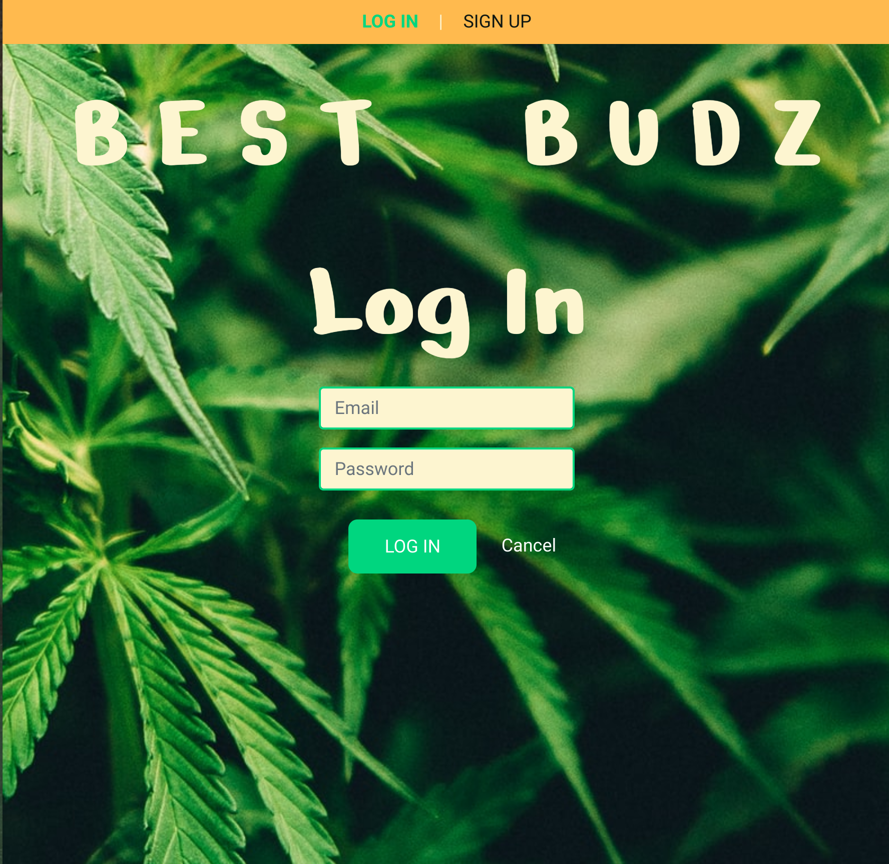
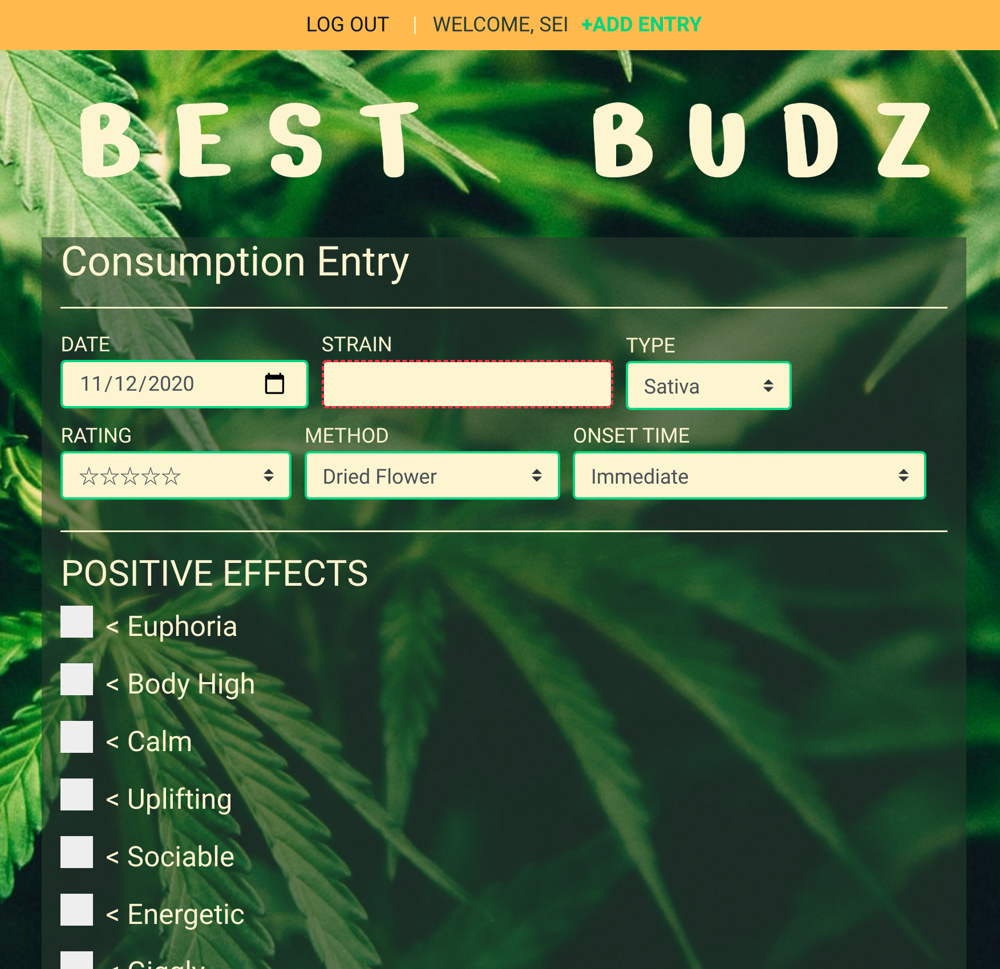
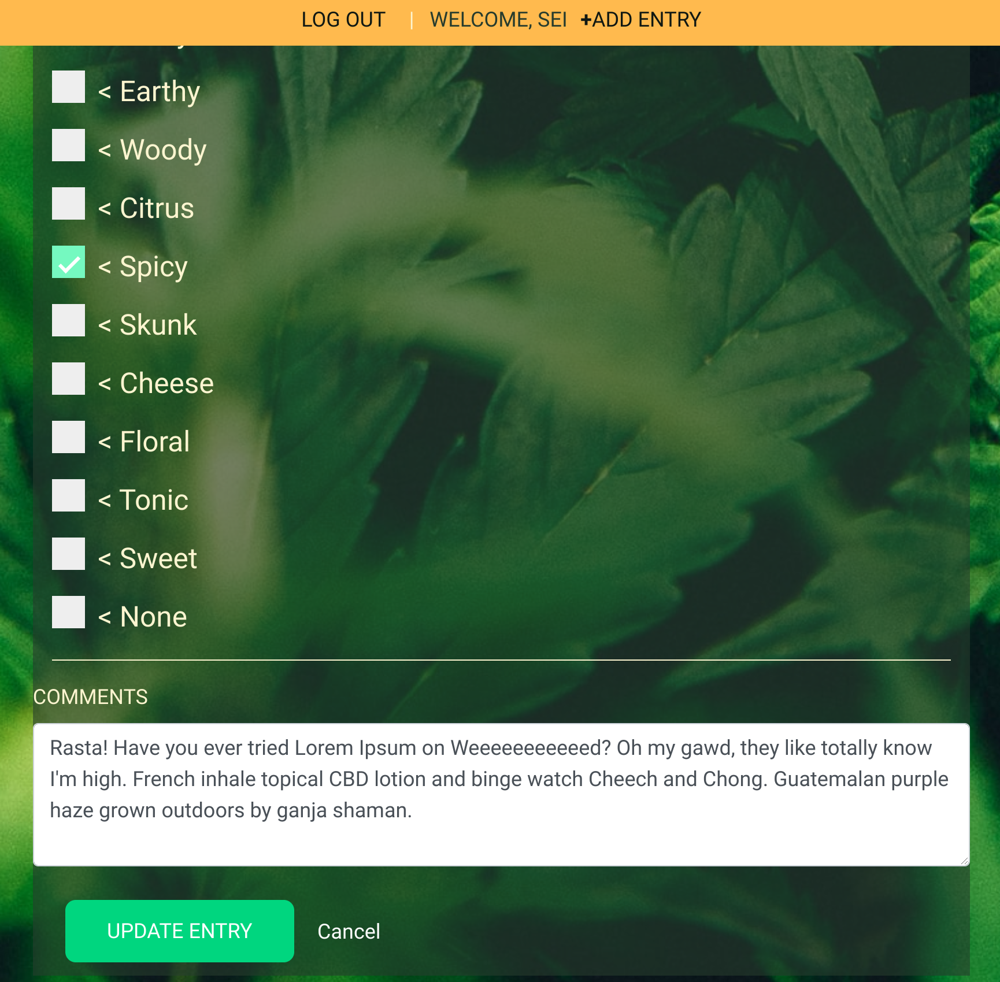
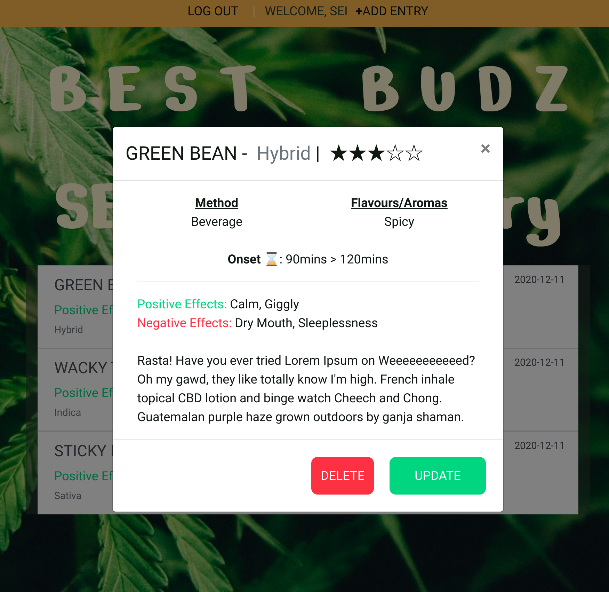

# Best Budz
This app is a cannabis consumption diary. There are a lot of cannabis strains and products out there. It can be quite overwhelming even for 'seasoned vets'. Thus, this app was created to allow users to log their experiences with differenct cannabis strains. Soon this site will include a large database of strains including, strain attributes. Users will be able to select strains from the database and add them to their consumption diary, comment or leave reviews on strains.
---
### Screenshots
    

### Technologies Used:
- MongoDB/Mongoose
- Express
- React
- Node

### Gettting Started
[Link to Best Budz](https://best-budz.herokuapp.com/)
Signup or login. Then venture over to your diary page (Dank Diary). If it's your first time, there will be no entries so add an entry using the link in the navbar or on the diary page. Fill out the form and voila. You can view a list of your entries on the Dank Diary. Also, you can see a more detailed view if you click on an entry.

### Next Steps/Icebox Items:
- implement diary search feature
- implement a User Page (including, highest rated strains and maybe cannabis news)
- create a strain page that lists a bunch of strains and their statistics
- add analytics based on user input
